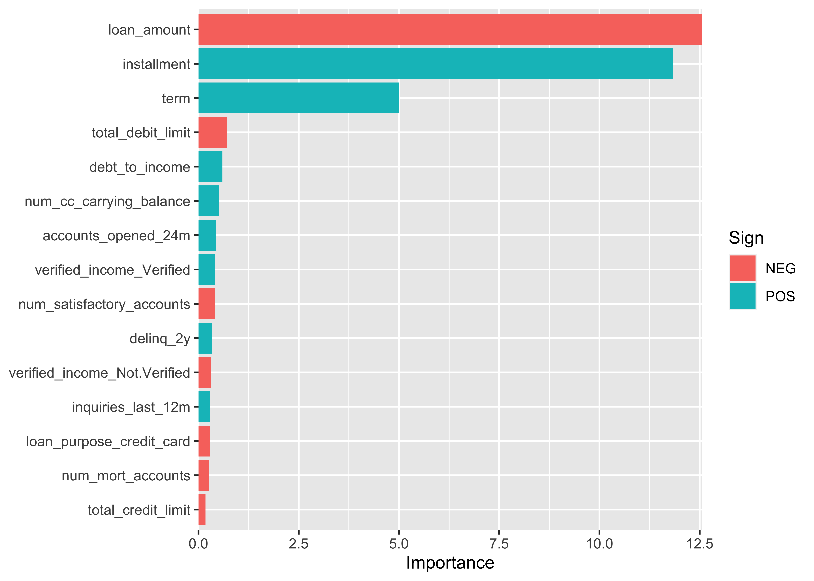

Tidymodels Basics
================

### Overview

  - This notebook covers basic modeling code patterns using the
    tidymodels framework.
  - “The tidymodels framework is a collection of packages for modeling
    and machine learning using tidyverse principles.” -
    [tidymodels.org](https://www.tidymodels.org/)
  - Book: [Tidy Modeling with R by Max Kuhn AND Julia
    Silge](https://www.tmwr.org/)
  - Using OpenIntro Lending Club [loan
    data](https://www.openintro.org/data/index.php?data=loans_full_schema)
    uncover key predictors/drivers for loan interest rates.

<!-- end list -->

``` r
options(scipen=999) 
library(tidyverse)
library(tidymodels)
library(openintro)
library(janitor)
library(skimr)
```

### Data Setup

  - Lending Club is a peer to peer loan platform. The data explored in
    this notebook represents loans made (see link above for more
    details).
  - Imagine we’re tasked with understanding what are drivers behind loan
    interest rates.
  - This is a practice scenario (this might not be a relevant business
    question internal to Lending Club).

<!-- end list -->

``` r
individual_loans <- loans_full_schema %>%
      ### build model on subset of individual loans granted
      ### joint also included in the dataset
      filter(application_type=="individual") %>%
      ### subjective human decision to exclude certain features
      dplyr::select(
             -emp_title,
             -emp_length,
             -state,
             -annual_income_joint,
             -verification_income_joint,
             -application_type,
             -grade:-paid_late_fees)

### collect set of columns that contain NAs
### in real world more care even to understand NAs 
### and or use imputation methods to fill NAs in
na_cols <- individual_loans %>%
      summarise_all(.funs = ~sum(is.na(.))) %>%
      gather() %>%
      arrange(desc(value)) %>%
      filter(value>0) %>%
      pull(key)

### drop NA columns to get a practice modeling dataset
individual_loans <- individual_loans %>%
      dplyr::select(-any_of(na_cols))
```

### Brief EDA

  - Brief numeric feature summary stats for starting point modeling
    data.
  - More EDA work would be done here in a real world setting to inspire
    modeling approach and feature engineering.

<!-- end list -->

``` r
skimr::skim_without_charts(individual_loans) %>%
      yank("numeric") %>%
      select(-n_missing, -complete_rate)
```

**Variable type: numeric**

| skim\_variable                   |      mean |        sd |      p0 |      p25 |       p50 |       p75 |       p100 |
| :------------------------------- | --------: | --------: | ------: | -------: | --------: | --------: | ---------: |
| annual\_income                   |  82321.92 |  67064.76 | 5235.00 | 48000.00 |  68200.00 | 100000.00 | 2300000.00 |
| debt\_to\_income                 |     17.34 |      8.76 |    0.00 |    10.72 |     16.79 |     23.38 |      39.99 |
| delinq\_2y                       |      0.22 |      0.69 |    0.00 |     0.00 |      0.00 |      0.00 |      13.00 |
| earliest\_credit\_line           |   2001.43 |      7.74 | 1963.00 |  1998.00 |   2003.00 |   2006.00 |    2015.00 |
| inquiries\_last\_12m             |      1.96 |      2.36 |    0.00 |     0.00 |      1.00 |      3.00 |      29.00 |
| total\_credit\_lines             |     22.68 |     11.93 |    2.00 |    14.00 |     21.00 |     29.00 |      87.00 |
| open\_credit\_lines              |     11.45 |      5.91 |    0.00 |     7.00 |     10.00 |     15.00 |      51.00 |
| total\_credit\_limit             | 175983.15 | 186210.23 |    0.00 | 49000.00 | 105538.00 | 254999.00 | 3386034.00 |
| total\_credit\_utilized          |  49921.79 |  53885.47 |    0.00 | 18703.00 |  35446.00 |  63235.00 |  942456.00 |
| num\_collections\_last\_12m      |      0.02 |      0.13 |    0.00 |     0.00 |      0.00 |      0.00 |       3.00 |
| num\_historical\_failed\_to\_pay |      0.17 |      0.72 |    0.00 |     0.00 |      0.00 |      0.00 |      52.00 |
| current\_accounts\_delinq        |      0.00 |      0.01 |    0.00 |     0.00 |      0.00 |      0.00 |       1.00 |
| total\_collection\_amount\_ever  |    189.39 |   2358.35 |    0.00 |     0.00 |      0.00 |      0.00 |  199308.00 |
| current\_installment\_accounts   |      2.63 |      2.93 |    0.00 |     1.00 |      2.00 |      3.00 |      35.00 |
| accounts\_opened\_24m            |      4.43 |      3.18 |    0.00 |     2.00 |      4.00 |      6.00 |      29.00 |
| num\_satisfactory\_accounts      |     11.42 |      5.90 |    0.00 |     7.00 |     10.00 |     14.00 |      51.00 |
| num\_accounts\_30d\_past\_due    |      0.00 |      0.01 |    0.00 |     0.00 |      0.00 |      0.00 |       1.00 |
| num\_active\_debit\_accounts     |      3.67 |      2.47 |    0.00 |     2.00 |      3.00 |      5.00 |      32.00 |
| total\_debit\_limit              |  27589.54 |  26817.77 |    0.00 | 10000.00 |  19600.00 |  36200.00 |  386700.00 |
| num\_total\_cc\_accounts         |     13.14 |      7.94 |    2.00 |     7.00 |     11.00 |     17.00 |      66.00 |
| num\_open\_cc\_accounts          |      8.19 |      4.96 |    0.00 |     5.00 |      7.00 |     11.00 |      46.00 |
| num\_cc\_carrying\_balance       |      5.30 |      3.36 |    0.00 |     3.00 |      5.00 |      7.00 |      43.00 |
| num\_mort\_accounts              |      1.31 |      1.70 |    0.00 |     0.00 |      1.00 |      2.00 |      14.00 |
| account\_never\_delinq\_percent  |     94.55 |      9.24 |   20.00 |    92.30 |    100.00 |    100.00 |     100.00 |
| tax\_liens                       |      0.04 |      0.63 |    0.00 |     0.00 |      0.00 |      0.00 |      52.00 |
| public\_record\_bankrupt         |      0.13 |      0.34 |    0.00 |     0.00 |      0.00 |      0.00 |       3.00 |
| loan\_amount                     |  15748.84 |  10091.62 | 1000.00 |  8000.00 |  13000.00 |  21000.00 |   40000.00 |
| term                             |     42.77 |     10.80 |   36.00 |    36.00 |     36.00 |     60.00 |      60.00 |
| interest\_rate                   |     12.30 |      4.92 |    5.31 |     7.97 |     11.98 |     15.05 |      30.94 |
| installment                      |    461.19 |    289.34 |   30.75 |   246.00 |    379.45 |    626.46 |    1503.89 |

### Create train and test data

``` r
### generate boiler plate code pattern with usemodels package to speed up workflow
### usemodels::use_glmnet(interest_rate ~ ., data = individual_loans)
### models that usemodels package generates boiler plate code for: ls("package:usemodels", pattern = "^use_")
set.seed(123)
loans_split <- initial_split(individual_loans, prop=0.8, strata=interest_rate)
loans_train <- training(loans_split)
loans_test <- testing(loans_split)

set.seed(123)
### 5 fold cross validation
loans_folds <- vfold_cv(loans_train, v=5)
```

### Set model type

``` r
lasso_regression_mod <- 
  ### lasso linear regression
  linear_reg(penalty = tune(), mixture = 1) %>% 
  set_mode("regression") %>% 
  set_engine("glmnet") 
```

### Feature engineering recipe

``` r
lasso_regression_recipe <- 
      recipe(formula = interest_rate ~ ., data = loans_train) %>% 
  step_novel(all_nominal_predictors()) %>% 
  step_dummy(all_nominal_predictors()) %>% 
  step_nzv(all_predictors()) %>% 
  step_normalize(all_numeric_predictors()) 
```

### Build modeling workflow

``` r
lasso_regression_workflow <- 
      workflow() %>% 
      add_model(lasso_regression_mod) %>% 
      add_recipe(lasso_regression_recipe)
```

### Parameter Tuning

  - Similar results for small penalty values

<!-- end list -->

``` r
lasso_regression_grid <- tibble(penalty = 10^seq(-6, -1, length.out = 5)) 

lasso_regression_tune <- 
      tune_grid(lasso_regression_workflow, 
                resamples = loans_folds, 
                grid = lasso_regression_grid)

lasso_regression_tune %>%
      collect_metrics() %>%
      filter(.metric=="rmse")
```

    ## # A tibble: 5 × 7
    ##     penalty .metric .estimator  mean     n std_err .config             
    ##       <dbl> <chr>   <chr>      <dbl> <int>   <dbl> <chr>               
    ## 1 0.000001  rmse    standard    3.15     5  0.0271 Preprocessor1_Model1
    ## 2 0.0000178 rmse    standard    3.15     5  0.0271 Preprocessor1_Model2
    ## 3 0.000316  rmse    standard    3.15     5  0.0271 Preprocessor1_Model3
    ## 4 0.00562   rmse    standard    3.15     5  0.0269 Preprocessor1_Model4
    ## 5 0.1       rmse    standard    3.37     5  0.0226 Preprocessor1_Model5

### Fit final model based on param tuning results

``` r
best_params <- lasso_regression_tune %>% select_best("rmse")

lasso_regression_final_params <- 
  tibble(penalty = best_params$penalty)

final_lasso_regression_workflow <- 
  lasso_regression_workflow %>%
  finalize_workflow(parameters = lasso_regression_final_params)

final_lasso_regression_fit <- 
  final_lasso_regression_workflow %>%
  fit(loans_train)
```

### Variable importance

  - Pulse check on features that are most influencial on interest rate
    prediction

<!-- end list -->

``` r
final_lasso_regression_fit %>%
  extract_fit_parsnip() %>%
  vip::vi(lambda = best_params$penalty, method="model") %>%
  filter(row_number()<=15) %>%
  ggplot(aes(x = Importance, y = reorder(Variable, Importance), fill = Sign)) +
  geom_col() +
  scale_x_continuous(expand = c(0, 0)) +
  labs(y = NULL)
```



### Test data model performance

``` r
predict(final_lasso_regression_fit, loans_test) %>%
      mutate(actual = loans_test$interest_rate) %>%
      rmse(truth=actual, estimate=.pred)
```

    ## # A tibble: 1 × 3
    ##   .metric .estimator .estimate
    ##   <chr>   <chr>          <dbl>
    ## 1 rmse    standard        3.08
